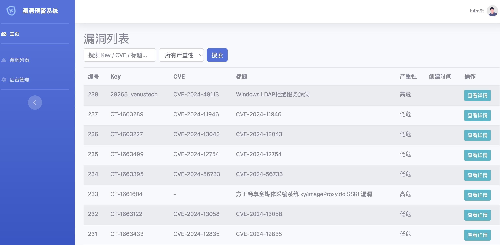

# VulnAlert


基于 Django 的漏洞管理预警系统，整合了 [WatchVuln](https://github.com/zema1/watchvuln) 漏洞爬虫引擎，为用户提供详细的漏洞预警信息。



## 目录
- [功能](#功能)  
- [项目架构](#项目架构)  
- [安装](#安装)  
  - [前提条件](#前提条件)  
  - [克隆仓库](#克隆仓库)  
  - [创建并激活虚拟环境](#创建并激活虚拟环境)  
  - [安装依赖](#安装依赖)  
  - [下载并运行 WatchVuln](#下载并运行-watchvuln)  
  - [配置数据库](#配置数据库)  
  - [创建迁移文件与应用迁移](#创建迁移文件与应用迁移)  
  - [创建超级用户](#创建超级用户)  
  - [运行开发服务器](#运行开发服务器)  
- [使用方法](#使用方法)  
  - [访问应用](#访问应用)  
  - [用户认证](#用户认证)  
  - [管理漏洞](#管理漏洞)  
- [致谢](#致谢)  

---

## 功能

- **用户认证与权限控制**：使用 Django 内建的认证机制，保护敏感漏洞信息仅授权可见。  
- **漏洞管理**：支持查看、搜索、分页浏览漏洞，详细信息包括描述、严重程度、CVE 参考等。  
- **易用且简洁的界面**：前端基于 [Start Bootstrap SB Admin 2](https://startbootstrap.com/theme/sb-admin-2)，提供响应式布局与清晰的操作逻辑。  
- **WatchVuln 集成**：自动获取高价值漏洞并存储到本地 SQLite 数据库 `vuln_v3.sqlite3`，减少手动收集的工作量。  

---

## 项目架构

- **后端**  
  - **Django**（Python Web 框架）：处理请求、管理数据库和用户认证逻辑。  
  - **数据库**：默认为 SQLite3（可按需切换到 PostgreSQL、MySQL 等）。  
- **前端**  
  - **SB Admin 2 模板**：基于 Bootstrap，提供响应式的管理后台界面。  
- **漏洞爬取引擎**  
  - **WatchVuln**：自动爬取公开漏洞信息并写入本地数据库 `vuln_v3.sqlite3`。

---

## 安装

以下步骤将引导你在本地环境中搭建 VulnAlert。

### 前提条件
- **Python 3.8+**：
- **WatchVuln**：从 [GitHub 仓库](https://github.com/zema1/watchvuln) 获取，确保正确配置并能够成功生成 `vuln_v3.sqlite3`。

### 克隆仓库
```bash
git clone https://github.com/h4m5t/vulnalert.git
cd vulnalert
```

### 创建并激活虚拟环境
```bash
# 创建虚拟环境
python3 -m venv venv

# macOS / Linux 激活
source venv/bin/activate

# Windows 激活
venv\Scripts\activate
```

### 安装依赖
```bash
pip install -r requirements.txt
```
### 下载并运行 WatchVuln

1. 前往 [WatchVuln Releases](https://github.com/zema1/watchvuln/releases)，下载适合你平台的二进制文件。  
2. 将该二进制文件放在当前目录或可执行路径中。  
3. 执行：  参考WatchVuln教程
   ```bash
   ./watchvuln  -c config.yaml
   ```
   该命令会自动生成 `vuln_v3.sqlite3` 数据库。

### 配置数据库

- VulnAlert 默认使用与 WatchVuln 同步的 `vuln_v3.sqlite3` 文件进行数据读取。建议使用默认的 SQLite3 数据库。若需使用其他数据库，请在 `vuln_alert/settings.py` 中以及 WatchVuln 的配置文件`config.yaml`中进行相应修改以保持一致。

### 创建迁移文件与应用迁移
```bash
python manage.py makemigrations
python manage.py migrate
```

### 创建超级用户
```bash
python manage.py createsuperuser
```
按照提示设置登录信息，以便后续访问 Django 管理后台。

### 运行开发服务器
```bash
python manage.py runserver
```
在浏览器打开 [http://127.0.0.1:8000/](http://127.0.0.1:8000/) 即可访问应用。

---

## 使用方法

### 访问应用
- 在浏览器中输入 [http://127.0.0.1:8000/](http://127.0.0.1:8000/) 打开 VulnAlert。
- 进入登录页面或者点击导航栏的“登录”。

### 用户认证
- **登录**：访问 `/login/` 并输入管理员或普通用户凭据。  
- **注销**：点击导航栏中的“注销”链接，结束当前会话。

### 管理漏洞
- **漏洞列表**：以分页形式展示所有漏洞，便于快速浏览。  
- **漏洞详情**：点击任意漏洞标题查看完整细节，如关键字、描述、严重性、CVE 参考、披露日期、解决方案等。

---

## 致谢

- [WatchVuln](https://github.com/zema1/watchvuln)： 提供高价值漏洞爬取与推送服务，VulnAlert 使用其生成的数据库文件。
- [Start Bootstrap - SB Admin 2](https://startbootstrap.com/theme/sb-admin-2)：提供简洁、可定制的前端模板，实现响应式布局。

---

## To Do

- [x] 添加漏洞模糊搜索功能
- [x] 实现用户角色管理
- [ ] 优化数据可视化功能
- [ ] 实现漏洞导入导出功能


##  Stargazers over time

 [](https://starchart.cc/h4m5t/vulnalert)